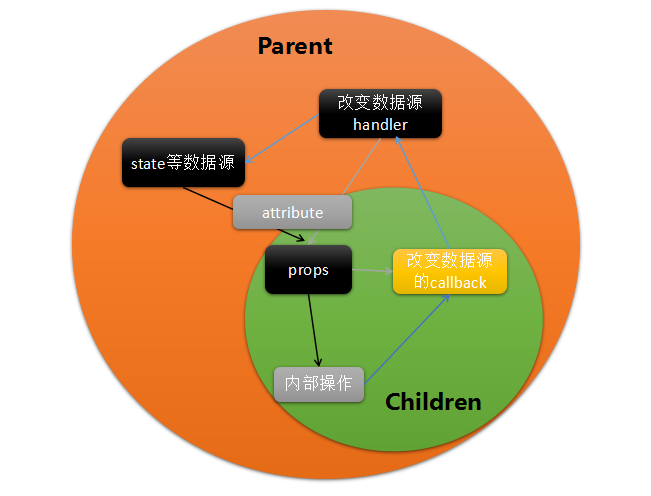

## 第二节 React的数据流
React中的数据是单向流动的，即从父组件递归的向子组件传递，只要父组件中的数据源的数据更新，则所有依赖于此数据的子组件才会更新，子组件是不能通过自己的方式来改变源头数据的，只能通过父组件传递给子组件的方式来调用改变数据。

React中的数据流是依赖于props与state两个属性实现的，state可以当作数据源，通过setState可以实现界面的数据驱动更新；props则是父子组件传递数据的媒介，父组件通过在子组件的属性上绑定数据，允许子组件通过props来获取只读这些数据，并进行后续操作。
```js
/* Children组件 */
class Children extends Component{
    render(){
        return (
            <div>
                <h3>I'm Children</h3>
                <p>Message from Parent: 
                    <strong>{ this.props.message }</strong>
                </p>
            </div>
        )
    }
}
/* Parent组件 */
class Parent extends Component{
    constructor(){
        super()
        //设置响应式的数据源
        this.state = {
            message: 'Hello child from "Parent"'
        }
    }
    render(){
        return (
            <div>
                <h2>I'm Parent</h2>
                <Children message={ this.state.message }/>
            </div>
        )
    }
}
```

Parent组件通过state设置了数据state.message，通过调用Children组件，并通过message属性绑定state.message，Children组件通过props.message读取传递过来的数据进行显示或者其他操作。props可以传递数据，当然也可以传递函数等其他类型的信息，那么可以实现Children来驱动改变数据，只要通过Parent传递改变state的方式给Children，Children组件需要改变数据时候去调用这个方式就可以了。

```js
/* 在Parent组件中添加改变state的方法 */
class Parent extends Component{
    constructor(){
        super()
        this.state = {
            message: 'Hello child from "Parent"'
        }
    }
    changeMessage(message){
        this.setState({message})
    }
    render(){
        return (
            <div>
                <h2>I'm Parent</h2>
                <Children 
                    message={ this.state.message }
                    changeMessage={ this.changeMessage.bind(this) }
                    />
            </div>
        )
    }
}
/* 在Children组件中触发这个方式来改变数据 */
class Children extends Component{
    toSendMyMessage(){
        let myMessage = 'I get it.'
        this.props.changeMessage && this.props.changeMessage(myMessage)
    }
    render(){
        return (
            <div>
                <h3 
                    onClick={this.toSendMyMessage.bind(this)}
                    >I'm Children</h3>
                <p>Message from Parent: 
                    <strong>{ this.props.message }</strong>
                </p>
            </div>
        )
    }
}
```

当点击I'm Children时，就会执行到Parent的changeMessage中的setState中，改变state.message为'I get it'，之后React会从Parent开始递归的更新子组件中的数据，并逐个render，重新构建Visual DOM，之后与上一次的Visual DOM进行diff运算得到patch，之后讲这个改变差异真实的反应在DOM树中，完成界面更新，最后到Message from Parent：I get it.


