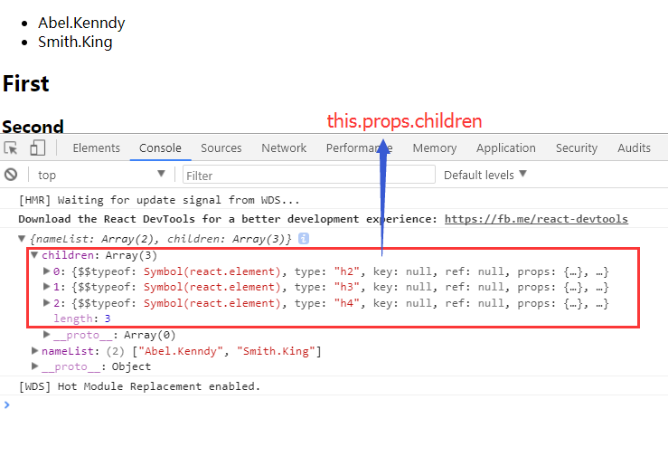

## 第三节 Props
上一节中简单的说明了一下React中的数据流向，里面涉及到两个属性props与state，这一节就主要讲解props相关内容。

### Props
> React中的props主要是用于父组件向子组件传递数据，父组件通过`attributes`的绑定数据，子组件通过`this.props`对象来读取对应的数据，是只读的，组件自身无法改变props的值
```js
/* 父组件 */
class Parent extends Component{
    render(){
        const list = ['Able.Kenndy', 'Smith.King']
        return (
            <Child nameList={list}/>
        )
    }
}
/* 子组件 */
class Children extends Component{
    render(){
        return (
            <div> {this.props.nameList} </div>
        )
    }
}
```
子组件通过`this.props.nameList`获取父组件绑定在Children的nameList属性上的数据。这里传递的是一个数组，直接展示在div中，React会自动处理数组的展示，将数组中的项逐个当成子组件展示在容器中。这里可以使用数组的map 函数方便的对数组包装处理。
```js
/* 子组件 */
class Children extends Component{
    render(){
        const { namelist } = this.props
        return (
            <div>
                <ul>
                { 
                    nameList.map( (item,i) => <li key={i}>{item}</li> )
                }
                </ul>
            </div>
        )
    }
}
```
以上的示例中通过map函数将数组中的内容包装在li标签中，最后返回的数组会被React逐项以子组件的方式展示。


这里是通过props传递数据，也可以传递各种类型的数据，包括函数，对于函数的传递，在上一节中子组件就是通过父组件传递的函数来改变数据源的数据的。在props对象中还有一个属性是经常会用到的，但不需要我们去声明属性的，就是`this.props.children`。
> `this.props.children`表示的是子组件使用的时候包裹着的组件对象组成的数组
```js
/* Parent组件 */
class Parent extends Component {
    render(){
        const list = ['Abel.Kenndy', 'Smith.King']
        return (
            <Children nameList = {list}>
                <h2>First</h2>
                <h3>Second</h3>
                <h4>Third</h4>
            </Children>
        )
    }
}
/* Child组件 */
class Children extends Component{
    render(){
        let { nameList } = this.props
        return (
            <div>
                <ul> {nameList.map((item,i) => <li key={i}>{item}</li>)} </ul>
                { this.props.children }
            </div>
        )
    }
}
````
Parent组件中使用Children组件时包裹了h2,h3,h3三个组件，这三个组件就可以通过`this.props.children`的方式获得，从上到下一次放在这个数组中，`this.props.children[0]`就对应`<h2>First</h2>`


打印出`this.props.children`属性如下


从打印出来的结果能看出对应的内容是包含着三个组件的数组，从这个例子中想到，我们其实也可以通过props直接传递一个组件到子组件中。
```js
/* Title */
class Title extends Component {
    render(){
        return (
            <h1>Title</h1>
        )
    }
}
/* Parent */
class Parent extends Component {
    render(){
        return (
            <Children title={<Title />} />
        )
    }
}
/* Children */
class Children extends Component {
    render(){
        return (
            <div>
                { this.props.title }
            </div>
        )
    }
}
```
使用es6语法时调用`constructor`时，为了在`constructor`中使用`this.props`，需要调用父类中的构造函数`super(props)`:
```js
class Children extends Component{
    constructor(props){
        super(props)
        console.log(this.props)
    }
}
```
其中调用`super()`是为了通过父类的构造函数来生成`this`，而`super(props)`是为了能在`constructor`函数中使用`this.prop`
