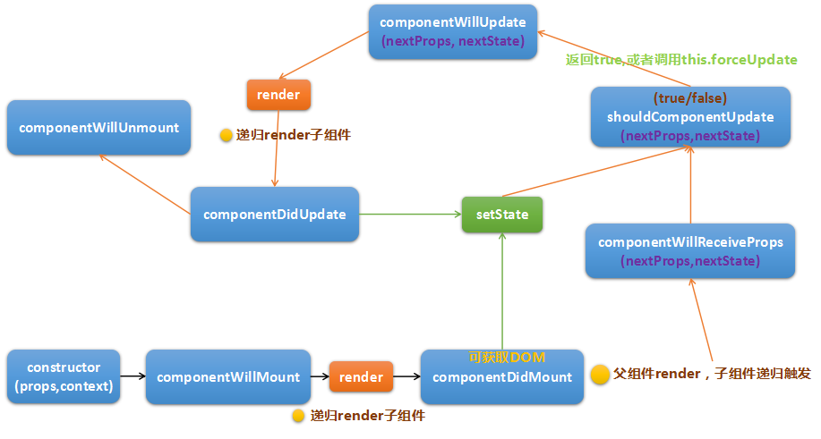
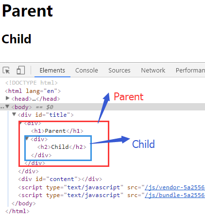
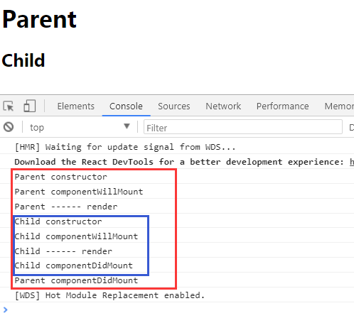
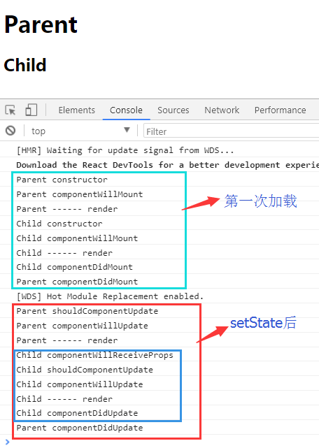

## 第六节 组件的生命周期
React在构建界面元素时是以组件为单位，组件在从无到界面显示并更新的过程中都有特定时间执行的特定函数，React允许我们通过这些钩子来添加自己的逻辑，从而可以在组件生成的各个阶段进行控制。以下为所有的钩子函数:

1. constructor(props, context) 组件的构造函数，负责组件的初始化工作，调用super初始化this  
2. componentWillMount 组件挂载之前，还不存在DOM，无法进行DOM操作，但可以操作state,props来做些数据的准备工作
3. componentDidMount 组件挂载之后，可以获取DOM并进行操作，再次render不会被调用
4. componentWillReceiveProps(nextProps, nextState) 当组件接受props(不管是否为新的)时触发，当父组件刷新时会被调用
5. shouldComponentUpdate(nextProps, nextState) 在setState时都会调用，返回true/false，默认true表示更新此组件，用于优化渲染
6. componentWillUpdate(nextProps, nextState) shouldComponentUpdate返回true或者调用forceUpdate之后被调用
7. componentDidUpdate 除首次外的其他render调用之后调用此函数
8. componentWillUnmount 组件被卸载时调用，需要清除定时器，DOM事件，引用等



上图粗略的展示React组件的生命周期钩子，每个钩子函数可以根据特点去做不同的工作，这里列举一些基础:  
1. constructor，组件构造函数。初始化组件的基本信息，初始this，初始state，还可以接受props来初始state
2. componentWillMount，组件初始挂载之前。运算或者获得数据，如ajax请求数据放入state中，依据props来初始化state，之后等待渲染。
3. componentDidMount，组件初始挂载完毕。可以获得元素对象(this.refs)，对DOM进行操作(不推荐)或者添加原生事件。
4. shouldComponentUpdate，组件setState之后，组件更新render之前。一般使用参数nextProps,nextState来做判断，最终确定是否需要执行render，从而达到优化性能的目的。
5. componentWillUnmount，组件卸载时。卸载时，主要是防止内存溢出的操作，如接触定时器，接触事件绑定等操作。

以上只是简单的列举了几种生命周期中可以做的工作，包括没列举的周期钩子还都可以做许多其他的工作，主要是考虑这些钩子触发的时机是否符合业务处理的需要，如果符合就可以将业务放入其中，如果不符合则再寻找其他钩子或者其他的方式来实现。  
示例代码
```js
import React, { Component } from 'react'
import ReactDOM from 'react-dom'
/* 子组件 */
class Child extends Component{
    static type = 'Child'
    constructor(){
        super()
        log(Child.type + ' constructor')
    }
    componentWillMount(){
        log(Child.type + ' componentWillMount')
    }
    componentDidMount(){
        log(Child.type + ' componentDidMount')
    }
    componentWillReceiveProps(nextProps, nextState){
        log(Child.type + ' componentWillReceiveProps')
    }
    shouldComponentUpdate(nextProps, nextState){
        log(Child.type + ' shouldComponentUpdate')
        return true
    }
    componentWillUpdate(nextProps, nextState){
        log(Child.type + ' componentWillUpdate')
    }
    componentDidUpdate(){
        log(Child.type + ' componentDidUpdate')
    }
    componentWillUnmount(){
        log(Child.type + ' componentWillUnmount')
    }
    render(){
        log('Child ------ render')
        return (
            <div>
                <h2>Child</h2>
            </div>
        )
    }
}
/* 父组件 */
class Parent extends Component {
    static type = 'Parent'
    constructor(){
        super()
        this.state = {
            msg: 'Parent to Child'
        }
        log(Parent.type + ' constructor')
    }
    componentWillMount(){
        log(Parent.type + ' componentWillMount')
    }
    componentDidMount(){
        log(Parent.type + ' componentDidMount')
    }
    componentWillReceiveProps(nextProps, nextState){
        log(Parent.type + ' componentWillReceiveProps')
    }
    shouldComponentUpdate(nextProps, nextState){
        log(Parent.type + ' shouldComponentUpdate')
        return true
    }
    componentWillUpdate(nextProps, nextState){
        log(Parent.type + ' componentWillUpdate')
    }
    componentDidUpdate(){
        log(Parent.type + ' componentDidUpdate')
    }
    componentWillUnmount(){
        log(Parent.type + ' componentWillUnmount')
    }
    render(){
        log('Parent ------ render')
        return (
            <div>
                <h1 onClick={ ()=>{this.setState({msg: 'P-C'})} }>Parent</h1>
                {/* {
                    this.state.msg === 'P-C' ? null : <Child msg={ this.state.msg }/>
                } */}
                <Child msg={ this.state.msg }/>
            </div>
        )
    }

}

function log(msg){
    console.log(msg)
}

ReactDOM.render(
    <Parent />,
    document.querySelector('#title')
)
```
以上代码声明了两个组件Parent，Child，其中Child是Parent的子组件，在Parent组件中绑定点击事件来改变state，而state.msg又传递给Child的props.msg。这里主要查看各个钩子函数的执行顺序。  
其中页面DOM结构:  



第一次加载时候的日志:

  

当点击Parent字时候，setState之后的日志:



