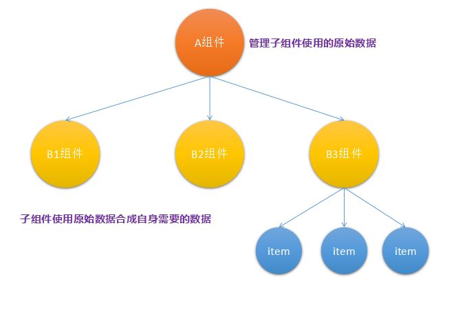
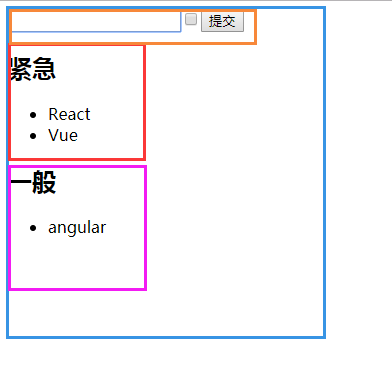

## 第七节 组件状态提升
当编写的多个组件需要使用到同样的数据时，不是去分别在多个组件中维护各自的数据状态并同步组件之间的状态，可以将公共的数据源分离出来，放在这些组件最近的公共父级中去管理维护，之后通过props的方式分发给各个组件，并提供相应的修改数据源的方式给各个组件来修改公共组件管理维护的数据源。这样可以使得数据流从上到下，方便数据的管理，使得组件编写更清晰方便，提高组件代码的复用性。



[第六节讲解生命周期](./6.第六节_组件的生命周期.md) 中讲到，当改变组件的state的时候调用`this.setState()`来完成改变并自动触发`render()`，在render过程中会递归调用其子组件的多个钩子函数到`render()`，这样可以在数据改变后，从父组件到最终的子组件都会依据自己的获取数据的逻辑重新拿到新数据并重新构建Visual DOM，得到差异patch，最终更新UI至最新的状态。这里利用父组件的state，通过子组件的props来同步数据源，达到效果。  

这里写一个简单的实例，添加列表:
```js
import React, { Component } from 'react'
import ReactDOM from 'react-dom'

/* 父组件 */
class ListBox extends Component{
    constructor(){
        super()
        this.state = {
            list: []
        }
    }
    onSubmit(item){
        this.setState({list: [...this.state.list, item]})
    }
    render(){
        return (
            <div>
                <Input submit={this.onSubmit.bind(this)}/>
                <ItemList flag={true} list = {this.state.list} />
                <ItemList flag={false} list = {this.state.list} />
            </div>
        )
    }
}
/* 输入框 */
class Input extends Component{
    constructor(){
        super()
        this.state = {
            value: '',
            flag: false
        }
    }
    onChange(e){
        this.setState({value: e.target.value})
    }
    changeFlag(e){
        this.setState({flag: !this.state.flag})
    }
    submit(){
        this.props.submit && this.props.submit({...this.state})
        this.setState({value:'',flag:false})
    }
    render(){
        return (
            <div>
                <input type='text' value={this.state.value} onChange={this.onChange.bind(this)}/>
                <input type='checkbox' checked={this.state.flag} onChange={this.changeFlag.bind(this)}/>
                <button onClick={this.submit.bind(this)}>提交</button>
            </div>
        )
    }
}
/* 展示栏 */
class ItemList extends Component{
    render(){
        let {list, flag} = this.props
        return (
            <div>
                <h2>{flag ? '紧急': '一般'}</h2>
                <ul>
                    {
                        list.map((item,i) => {
                            return item.flag === flag ? <li key={i}>{item.value}</li> : null
                        })
                    }
                </ul>
            </div>
        )
    }
}

ReactDOM.render(
    <ListBox />,
    document.querySelector('#root')
)
```

运行结果:

