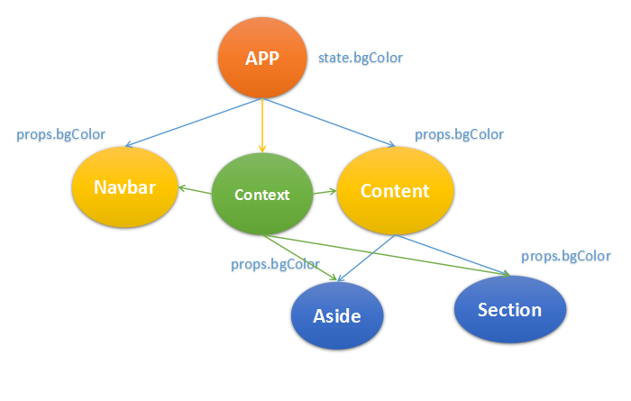

## 第九节 context
React中一直存在一个变量context，但是很不常用，应为存在数据流动紊乱的问题。context也是依附于组件存在的，在父组件中声明的context，在其所有的子组件都可获取得到的，类似于组件树上的一个全局变量。   
经常有换肤的需求，如整体色彩从蓝色调变为红色调。对于这样的需求，我们在组件中可以通过在一个公共的最近父组件中设定state来表征颜色，然后通过props属性来传递这个值和改变这个值的方式，即使有多层组件的嵌套，我们也需要一层一层的通过props来传递下去，当点击换肤按钮时，我们调用`setState`来改变数据源`state`，之后组件从父组件开始`re-render`，之后diff，最终将差异返回到界面上。  
以上的思路没有问题，只是在一层一层的传递props显的麻烦，如果在这个环境中有一个公用数据池，在这个环境中的组件都可以按照自己的需求获取数据，是很方便的，context就类似这样的数据池。



context在父组件中声明和初始化，在其子组件中声明需要使用到的数据，之后才能开始使用。在父组件中需要两步: 静态`childContextTypes`和函数`getChildContext`返回context对象。在子组件中需要声明需要的数据: 静态`contextTypes`。
```js
/* 应用入口 */
class App extends Component {
    //声明context类型
    static childContextTypes = {
        bgColor: PropTypes.string
    }
    constructor(){
        super()
        this.state = {
            bgColor: 'blue'
        }
        this.changeSurface = this.changeSurface.bind(this)
    }
    //初始化context
    getChildContext(){
        return {
            bgColor: this.state.bgColor
        }
    }
    //换肤，通过setState
    changeSurface(){
        this.setState({bgColor: 'red'})
    }
    render(){
        return (
            <div className='container'>
                <Navbar />
                <Content />
                <button onClick={this.changeSurface}>换肤</button>
            </div>
        )
    }
}
/* 导航 */
class Navbar extends Component {
    static contextTypes = {
        bgColor: PropTypes.string
    }
    render(){
        return (
            <nav style={{backgroundColor: this.context.bgColor}}>
                <h2>导航栏</h2>
            </nav>
        )
    }
}
/* 正文 */
class Content extends Component {
    static contextTypes = {
        bgColor: PropTypes.string
    }
    render(){
        return (
            <section style={{backgroundColor: this.context.bgColor}}>
                <h2>正文</h2>
            </section>
        )
    }
}
```

