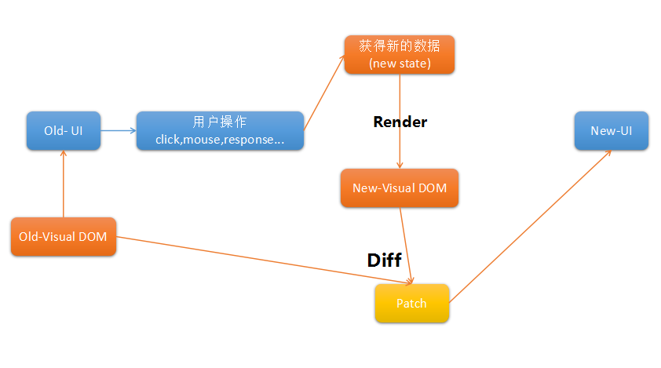

# 第一节 React介绍  
React是由facebook开发的js库，开发web用户界面，其实就是一个UI构建库，具有以下两个特点:    

1. 简单清晰。简单的利用数据告诉React时间点对应的应用状态，React就会自动根据数据变化来管理UI界面，达到应用的可预估性。  
2. 声明式。React会根据数据变化来部分更新界面，这与它的组件化构建密切相关。通过React以声明式的方式来封装构建一个一个的界面基础组件，并在需要的地方进行调用组合为UI，达到代码的复用，关注点分离，使得管理变得简单清晰。
```js
//这里声明一个组件
import React, { Component } from 'react'
import ReactDOM from 'react-dom'
class Title extends Component{
    render(){
        return (
            <h2>人民日报</h2>
        )
    }
}
//挂载到页面
ReactDOM.render(
    <Title />,
    document.querySelector('#root')
)
```


React就是用来构建UI界面的，不涉及到数据的管理，所以不属于MVC框架，只是其中view这一环节。对于数据的管理与控制会结合不同的库来实现，如Flux，Redux，Mbox等架构。

#### Visual DOM 虚拟DOM
传统的web应用一般是直接操作DOM元素，例如jQuery等库，直接对DOM树中的节点进行增删改查操作，这样的操作过程是昂贵的，React为了虚弱这一过程，在数据到真实DOM操作的中间又增加了一层虚拟DOM来做一个缓冲，数据改变，先依据新数据生成虚拟的DOM树(render)，将新Visual DOM与上一次的Visual DOM进行对比(diff)，最终得到哪些元素需要怎样的改变(patch)，之后再将这一部分的改变在真实DOM上操作，从而更新UI界面。


js中的对象可以分为四种:

1. 超轻量对象 Object.create(null)
2. 轻量对象(普通对象) {}
3. 重量对象 类似Visual DOM的对象
4. 超重量对象 DOM Node节点，window，document等

真实的DOM节点的属性个数多达70+，操作这样的一个超级对象是很不方便，消耗大量的性能，所以能尽量减少这样的操作将对应用的性能大有益处，所有采用属性较少(基础可能就3+)Visual DOM对象完成复杂的运算，最后得到很少的真实DOM操作，这样也算是合理的。如果严格的对数据生成的Visual DOM进行diff算法，将会降低真实DOM的操作复杂度，但会增加js运算的性能损耗，所以需要得到一个较为合理的diff比较，这里React就采用同层DOM比较的方式，将diff算法从O(n^2)的复杂度降低到了O(n)，对于能复用的节点会进行复用，但对于一些跨层复用的节点直接通过先删除再创建的方式更为直接方便，这是一种权衡。

React的数据比较是基于DOM结构的比较，也就是说，如果上一个状态与下一个状态在UI上是一致的，那就不需要更新，这是关注点，所有比较DOM节点是否改变是React的核心。而对于其他的库，如Vue，angular等则与React的实现是不同的，vue(getter/setter)采用的数据收集检查机制来判断是否更新界面，angular(digest)则是采用脏检查的方式来判断数据变化，从而执行对应的更新UI的回调。少量数据，vue较快；大量数据，angular的劣势会慢慢减弱；而对于React则一直是处于中间水平，不管什么规模的应用，在构建简单清晰的前提下，都能提供说的过去的性能，这就是React所考虑的。

React并不意味这快，它的出现主要是体现在两点：  
1. 打开了函数式UI编程的大门
2. 通过Visual DOM将UI结构绘制在内存中，可以实现跨平台多终端，如React-Native，React-Canvas等
